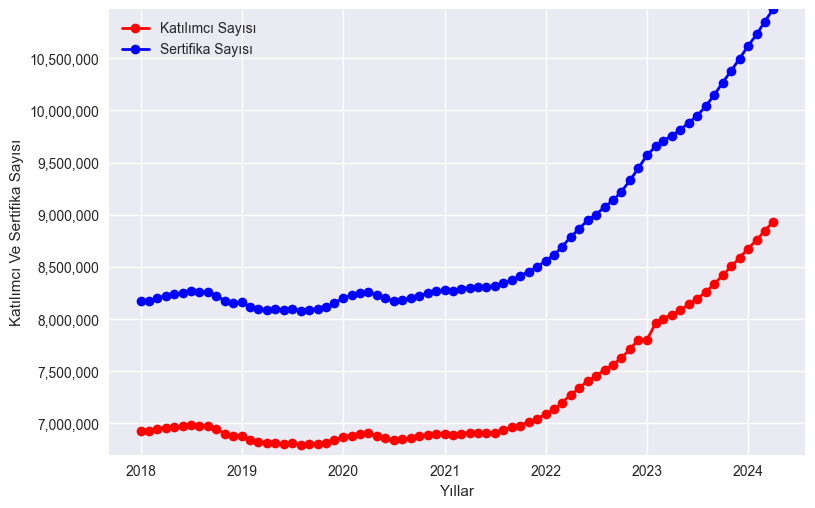
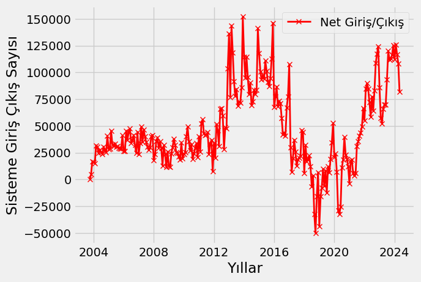
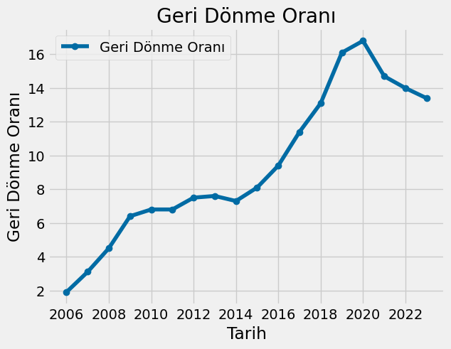
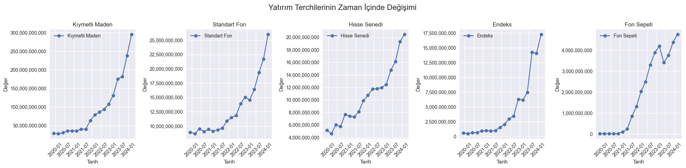
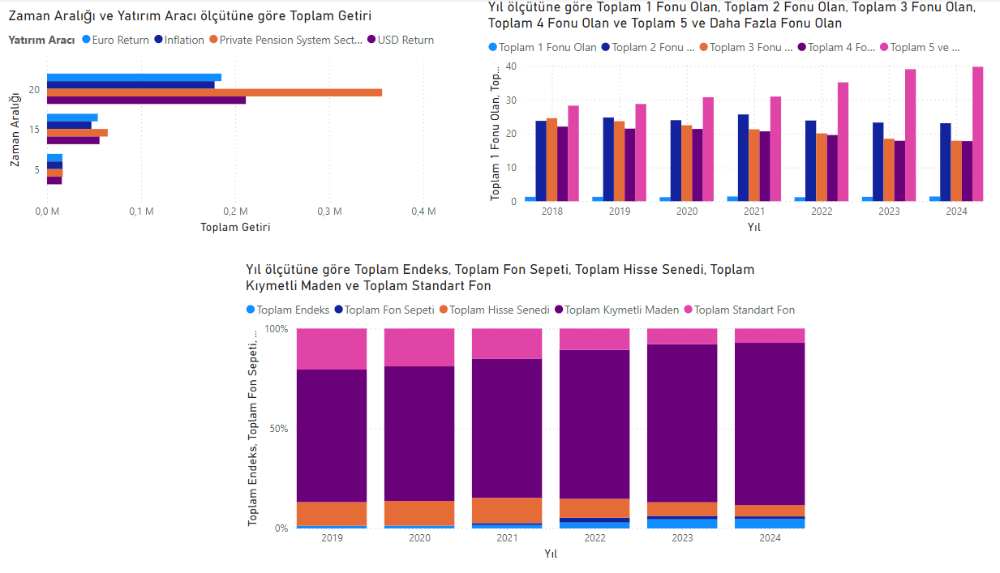
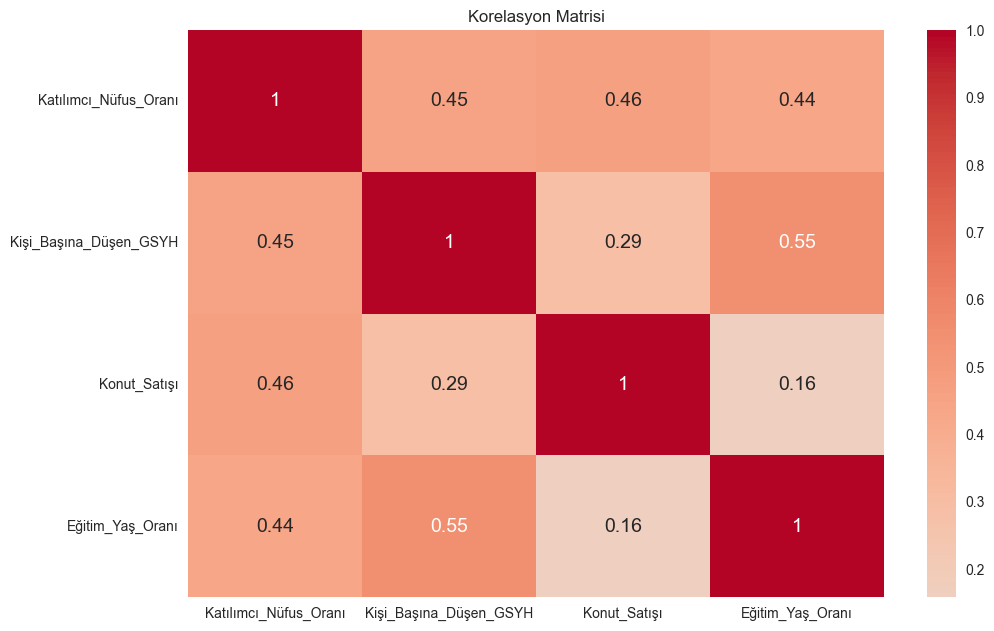
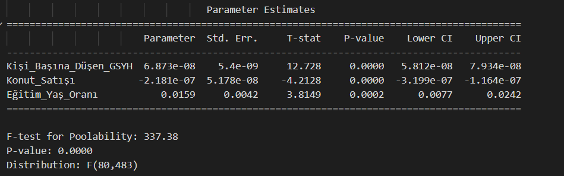

# Bireysel Emeklilik Sistemi Analizi
## Giriş
Bireysel Emeklilik Sistemi (BES), bireylerin emeklilik dönemlerinde finansal güvenliklerini sağlamak amacıyla tasarlanmış bir tasarruf ve yatırım sistemidir. Türkiye'de 2001 yılında yürürlüğe giren bu sistem, katılımcıların belirli bir süre boyunca düzenli olarak katkıda bulunmalarını ve bu katkıların birikmesini sağlar.BES, hem tasarruf yapma hem de uzun vadeli yatırım fırsatları sunarak bireylerin gelecekteki finansal ihtiyaçlarını karşılamayı hedefler.

Bu projede Bireysel Emeliklilik Sistemi'ne ait verilerin analizi yapılarak, bu sisteme katılımcı sayısının hangi değişkenlere göre arttığı veya azaldığı panel regresyon modeliyle beraber açıklanmaya çalışılacaktır. Bu projede kullanılmış olan bütün verileri Emeklilik Gözetin Merkezi ve TÜİK'in sitesinden alınmıştır. Verilerin görselleştirilmesi için Python ve Power BI kullanılmıştır.

## Analiz

Bireysel Emeklilik sistemindeki katılımcı ve sertifika sayısı 2022 yılına kadar sabit bir gelişim göstermiştir ancak o tarihten sonra daha hızlı bir şekilde artmıştır. Sertifika sayısı da katılımcı sayısıyla doğrudan ilişkili olduğu için onda da benzer bir eğilim görülmiştür. İlgili grafik aşağıda verilmiştir.

Bu grafiğe bakıldığında net olarak sisteme yapılan giriş ya da çıkışları göremiyoruz ancak net giriş çıkış grafiğine bakıldığında hangi yıllarda bu sisteme bakış açısının pozitif ya da negatif olduğunu anlayabiliriz.

Bu grafiğe bakıldığında 2012'den itibaren sisteme olan bakış açısının oldukça pozitif olduğu ve insanların sisteme diğer yıllara nazaran daha fazka giriş yapıldığı görülmektedir. Ancak bu artış 2016 yılındaki ciddi düşüşle beraber azalsa da 2020 yılıyla itibaren tekrar artışa geçmiştir. Grafiğe bakıldığında aklımıza şu soru gelebilir. Sisteme giriş yapanlar yeni bir katılımcı mı yoksa önceden çıkış yapmış olan katılımcılar mı? Bu sorunun cevabını aşağıdaki grafikte bulabiliriz.

Geri Dönme oranılarına bakıldığında 2014 yılına kadar oranlar stabil olsa da 2014 yılından 2020 yılına kadar ciddi bir atış göstererek %16 seviyelerine yaklaşmıştır. Ancak 2020 yılından itibaren düşüşe geçmiştir.

Bireysel Emeklilik Sistemi katılımcıları yıllar boyunca sistem içinde farklı yatırım araçlarına yönelmiştir.

Katılımcılar genel anlamda 5 farklı yatırım aracı kullanmıştır. Bunlar kıymetli maden, standart fon, hisse senedi, endeks, fon sepetidir.Grafiklere bakıldığında fon sepeti dışında diğer bütün yatırım araçlarının 2023 yılı ile birlikte ciddi bir artış gözlenmektedir. Fon sepeti 2023 yılının başında ciddi bir düşüş yaşasa da daha sonraki dönemlerde tekrar artışa geçmiştir.

En alttaki grafiğe bakıldığında katılımcılarının yüzdesel anlamda paralarının büyük bir kısmını kıymetli madene yatırdığı ve bu yüzdelerin yıllar boyunca arttığı gözlenmektedir. Kıymetli madenlerden sonra ise en fazla hisse senedi ve standart fona yatırım yapılmıştır.2.grafikte ise katılımcıların fon sayısı tercihleri ve bu fon sayısı tercihlerindeki değişimler görülmektedir. Grafiğe göre insanlar yıllar geçtikçe daha fazla fona yatırım yapmışlardır. İlk grafik ise BES ile diğer yatırım araçlarının kazançlarını kıyaslamaktadır. 5 yıl için kazançlar birbirine çok yakın olsa da 20 yılda BES enflasyonun da üzerine çıkarak diğer yatırım araçlarından fazla kazandırmıştır.

Panel Regresyon modelinde bağımlı değişken katılımcı/nüfus oranı seçilmiştir. Bağımsız değişkenler ise kişi başına düşen Gayri Safi Yurt İçi Hasıla, konut satışı ve eğitim yaş oranıdır. Eğitim yaş oranında en az lise mezunu olan ve yaşları 25-64 aralığında olan insan sayısı dikkate alınmıştır. 2016 yılından başlayarak her şehire ait veri TÜİK'ten alınmıştır.

Modele geçmeden önce bağımlı ve bağımsız değişkenler arasındaki korelasyona bakmakta fayda vardır. Yukarıda verilen korelasyon matrixine göre bağımsız değişkenler ile bağımlı değişkenler pozitif korelasyona sahiptir. Bu katsayılar kişi başına düşen gayrisafi milli hasıla için 0.45, konut satışı için 0.46 ve eğitim/yaş oranı için ise 0.44'tür.

Modlein sonuçlarına göe kişi başına düşen Gayri Safi Milli Hasıla ve eğitim/yaş oranı katılımcı/nüfus oranına pozitif bir etkiye sahiptir ve istatistiksel olarak anlamlıdır. Konut satışı da istatistiksel olarak anlamlıdır ancak negatif katsayıya sahiptir. Ayrıca öodelde her bir şehir için etkilerin dahil edilmiştir. Bu, her şehrin kendine özgü etkilerini kontrol etmektedir. Sonuç olarak katılımcı/nüfus oranını kişi başına düşen GSYH ve eğitim/yaş oranı pozitif yönde etkilerken konut satışı negatif yönde etkilemektedir.

